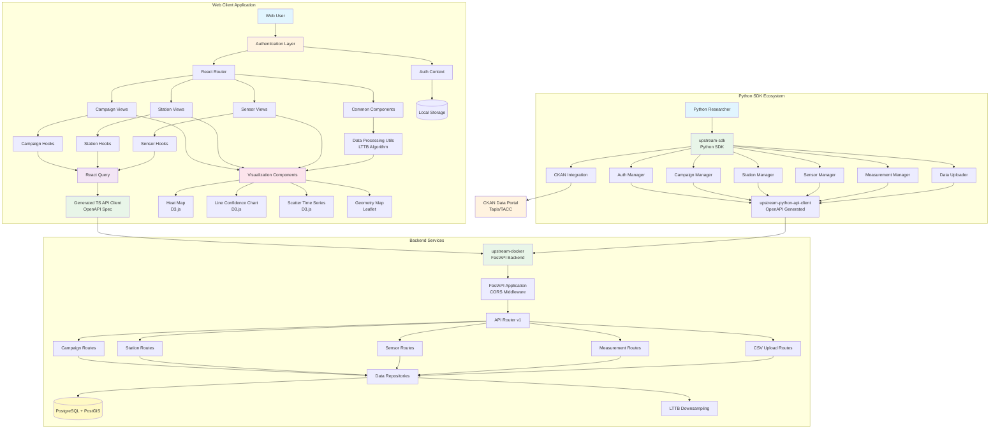
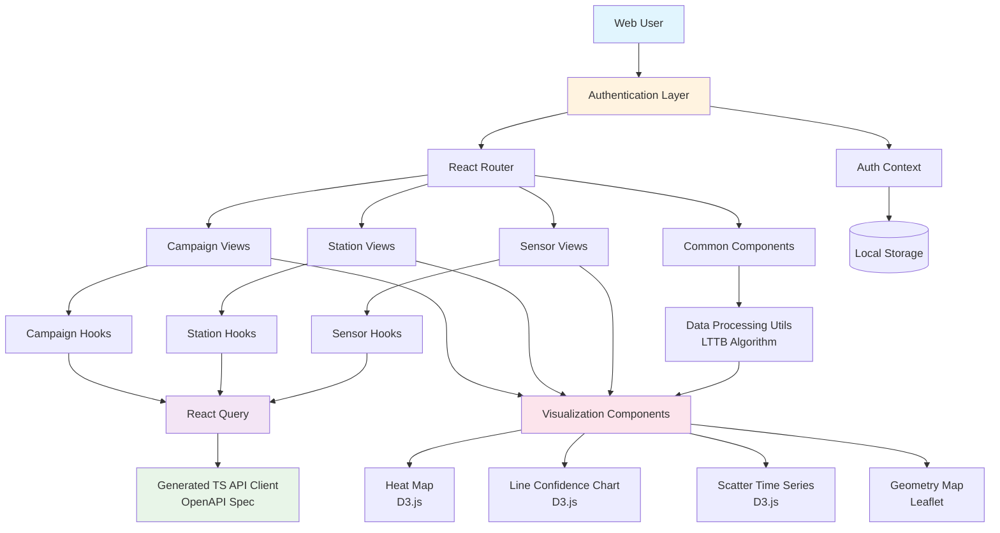
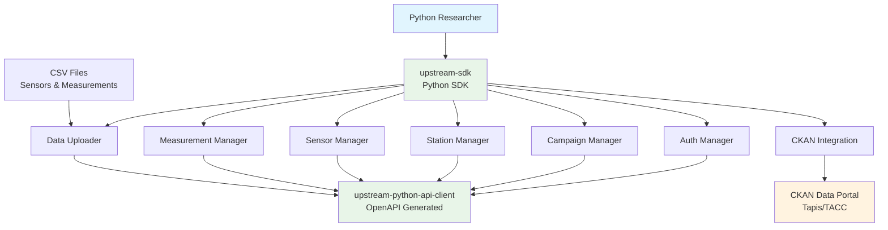
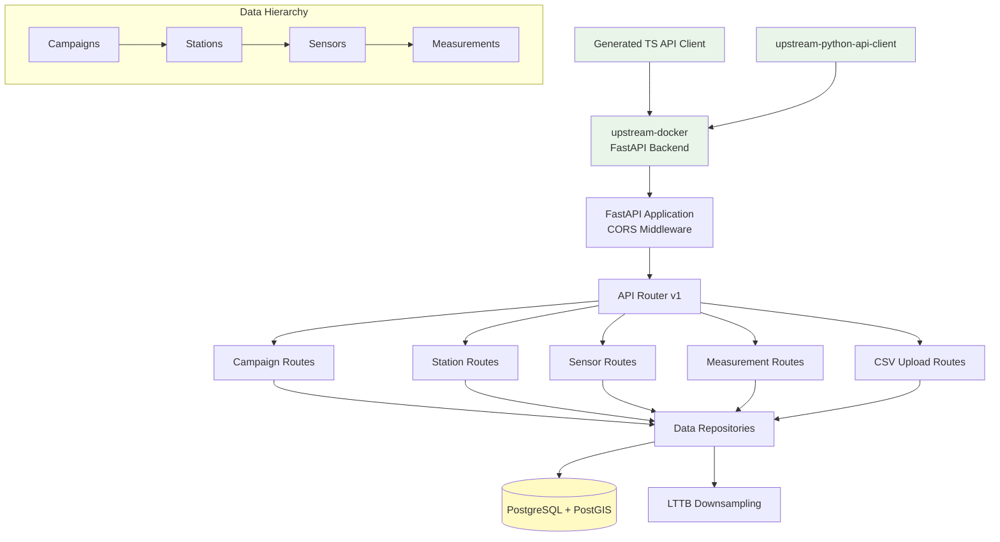
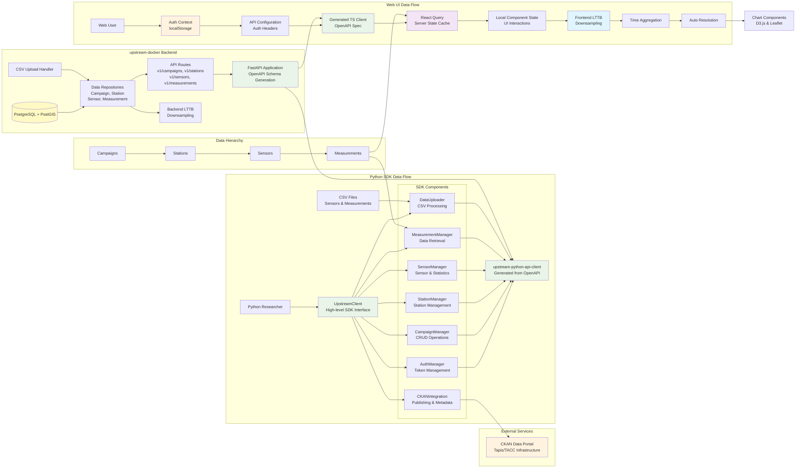

# Upstream Viz

A modern visualization platform for environmental sensor data. This application provides powerful tools for analyzing, visualizing, and exploring time-series data from environmental monitoring campaigns.

## Features

- **Multiple Visualization Types**:

  - Heat maps for spatial distribution of sensor readings
  - Time series charts with confidence intervals
  - Scatter plots for temporal data analysis
  - Interactive maps for geographic data exploration

- **Hierarchical Data Organization**:

  - Campaigns → Stations → Sensors → Measurements
  - Comprehensive filtering and search capabilities

- **Interactive UI**:

  - Built with React and TypeScript
  - Responsive design using Tailwind CSS
  - D3.js-powered visualizations

- **Data Analysis Tools**:
  - Statistical summaries and aggregations
  - Flexible time range selection
  - Data export capabilities

## Tech Stack

- **Frontend**: React, TypeScript, Tailwind CSS
- **Visualization**: D3.js, Leaflet
- **Routing**: React Router
- **Bundling**: Vite
- **API Integration**: Generated TypeScript client from OpenAPI specification
- **Python SDK**: [upstream-sdk](../upstream-sdk/) - High-level Python interface for researchers
- **Data Publishing**: CKAN integration via upstream-sdk for data discoverability

## Ecosystem Integration

The upstream-ui is part of a comprehensive environmental data platform ecosystem:

- **[upstream-ui](.)** - Interactive web visualization platform (this repository)
- **[upstream-sdk](../upstream-sdk/)** - Python SDK for programmatic data management and research automation
- **[upstream-docker](../upstream-docker/)** - FastAPI backend services and infrastructure
- **CKAN Data Portal** - Public data discovery and sharing platform

### Multi-Interface Access

The platform supports multiple user interfaces:

1. **Web Interface** (`upstream-ui`): Interactive visualization, data exploration, and real-time monitoring
2. **Python SDK** (`upstream-sdk`): Programmatic access for researchers, automated data pipelines, and CKAN publishing
3. **Direct API**: RESTful API access for custom integrations

Both the web interface and Python SDK consume the same underlying FastAPI backend, ensuring data consistency and feature parity.

## Architecture

### Conceptual Overview



### Architecture Components

The following diagrams break down each major component of the system architecture for easier understanding:

#### Web Client Application



#### Python SDK Ecosystem



#### Backend Services



### Data Flow Architecture



## Installation

1. Clone the repository:

   ```bash
   git clone https://github.com/your-org/upstream-viz.git
   cd upstream-viz
   ```

2. Install dependencies:

   ```bash
   npm install
   ```

3. Build the API client (required before first run):

   ```bash
   cd packages/upstream-api && npm run build && cd ../..
   ```

4. Start the development server:
   ```bash
   npm run dev
   ```

## Development

### Project Structure

```
src/
├── app/                  # Main application components
│   ├── Campaign/         # Campaign-related views
│   ├── Station/          # Station-related views
│   ├── Sensor/           # Sensor-related views
│   ├── common/           # Shared components
│   ├── HeatMap/          # Heat map visualization
│   ├── LineConfidenceChart/ # Line chart with confidence intervals
│   ├── RouterMap/        # Map-based visualizations
│   ├── TimeSeriesGraph/  # Time series visualization
│   └── ...
├── assets/               # Static assets
├── components/           # Generic UI components
├── contexts/             # React contexts
├── hooks/                # Custom React hooks
├── providers/            # Provider components
└── utils/                # Utility functions
```

### Available Scripts

- `npm run dev` - Start the development server
- `npm run build` - Build the project for production
- `npm run lint` - Run linter
- `npm run preview` - Preview production build

## Deployment

The application can be deployed as a static site or using Docker:

```bash
# Build for production
npm run build

# Using Docker
docker build -t upstream-viz .
docker run -p 8080:80 upstream-viz
```

## Contributing

Contributions are welcome! Please feel free to submit a Pull Request.

## License

This project is licensed under the MIT License - see the LICENSE file for details.
