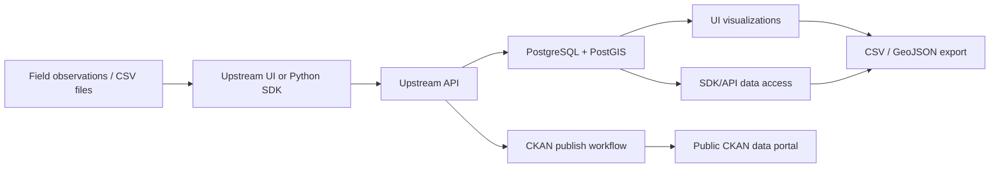
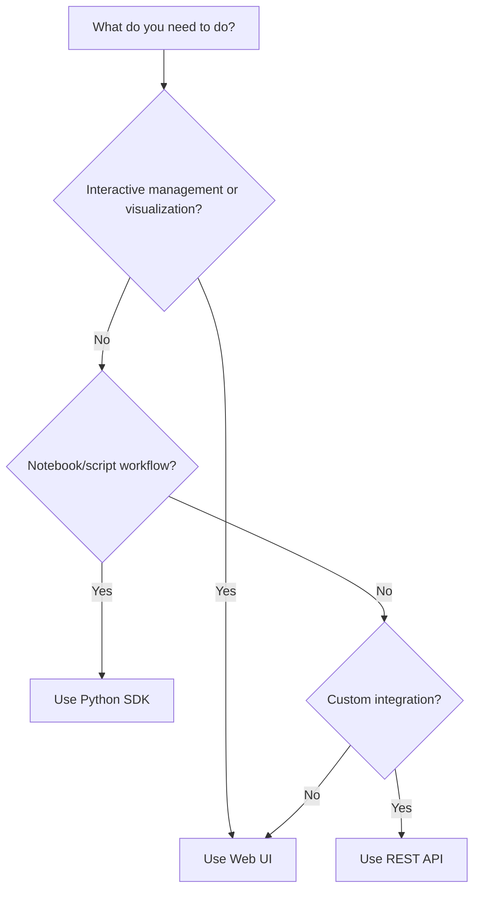

# Upstream End-User Documentation Site

## Status

Implemented

## Objective

Create an end-user documentation site for Upstream using MkDocs, hosted with the Upstream UI Pod at `/docs/`. The documentation should help users understand and operate the deployed Upstream product through the web UI, Python SDK, and direct API without focusing on internal UI hooks or developer implementation details.

## User need

### Primary user

Environmental researchers, field data managers, and project administrators using Upstream to collect, manage, visualize, access, export, and publish environmental sensor data.

### Secondary users

- Researchers using Python notebooks or scripts to access Upstream data programmatically.
- Technical users integrating directly with the REST API.
- Project administrators responsible for roles, metadata schemas, publication state, and dataset readiness.

### Job-to-be-done

Users need to move from field observations and CSV files into usable, discoverable Upstream datasets, then view, analyze, export, and optionally publish those datasets to CKAN.

### Current pain

Current documentation is split across README files, generated API-client Markdown, FastAPI Swagger pages, notebooks, and architecture docs. Generated API docs are complete but not end-user friendly. UI documentation explains developer architecture more than the user workflow. Users do not yet have one product-facing guide that explains data flow, site usage, SDK usage, endpoint quickstarts, CSV preparation, visualization behavior, and CKAN publication.

### Definition of success

- A user can open `https://upstream.pods.portals.tapis.io/docs/` and choose whether to use the UI, Python SDK, or API.
- A field/data user can follow a UI quickstart to sign in, create a campaign/station, upload CSV files, visualize data, export data, and publish.
- A researcher can follow an SDK quickstart and interactive notebook path to authenticate, list/create data resources, upload CSV data, retrieve measurements, export GeoJSON/CSV, and publish.
- A technical user can use endpoint quickstarts without needing to read the generated OpenAPI client docs.
- Visualization documentation explains temporal charts and spatial maps in terms users see in the UI.
- Documentation uses TACC Core Styles colors and lives in `upstream-ui/docs/` so it is built and served with the UI Pod.

## Current code/system summary

The root Upstream repository is a meta-repo with submodules for the API, UI, SDK, and generated Python API client. Relevant current behavior:

- `upstream-ui/` is the `upstream-ui-pods` React/Vite frontend, served by nginx from `/usr/share/nginx/html`.
- `upstream-ui/Dockerfile` currently builds the React app with Node and copies `dist/` into nginx.
- `upstream-ui/nginx.conf` serves the SPA and static assets, proxies `/api/` optionally, and currently falls back unknown routes to `index.html`.
- The UI already includes TACC Core Styles-derived Tailwind colors under `tacc.neutral`, `tacc.accent`, `tacc.secondary`, and `tacc.tertiary`.
- The unauthenticated landing page already links to the Python SDK, API documentation, and CKAN publication resources.
- The UI supports Tapis OAuth2 and legacy JWT auth flows, with tokens stored in `sessionStorage` or `localStorage` depending on mode.
- The UI supports campaign, station, sensor, measurement, upload, publish, metadata, notes, and administration workflows.
- `UploadDataModal` documents and validates sensor/measurement CSV format in the UI, including required columns, alias matching, examples, upload checklist, chunked upload progress, warnings, and duplicate skips.
- Example CSV files already exist under `upstream-ui/public/examples/data/`.
- Temporal visualization components include `LineConfidenceChart` and `ScatterTimeSeriesChart`; these should be documented together for end users.
- Spatial visualization components include `HeatMap` and `RouterMap`/geometry map behavior; these should be documented together with a clear explanation of differences.
- `upstream-sdk/` provides `UpstreamClient` and manager classes for campaigns, stations, sensors, measurements, data upload, CKAN, pods, user roles, notes, metadata schemas, and sensor variables.
- `upstream-docker-pods/` is the FastAPI backend with `/api/v1` endpoints and existing Swagger/OpenAPI docs at `/docs`.
- The generated Python API client docs exist but are not intended to be a primary end-user documentation surface.

## Proposed design

Add a MkDocs documentation site inside `upstream-ui/docs/`, build it as part of the UI Docker image, and serve the static documentation at `/docs/` from nginx.

The documentation will be product- and end-user-oriented. It will explain how to use the Upstream UI, Python SDK, and direct API to accomplish real tasks. It will include workflow pages, endpoint quickstarts, data model diagrams, data flow diagrams, CSV preparation guidance, visualization guidance, CKAN publishing guidance, troubleshooting, and reference material.

### Hosting and build

- Add MkDocs source under `upstream-ui/docs/`.
- Build docs into a static site during Docker build.
- Copy the generated docs site into `/usr/share/nginx/html/docs`.
- Add an nginx `/docs/` location so documentation routes do not fall through to the React SPA.
- Keep the current release at `/docs/`.
- Support historical release docs from Git tags, path-based under `/docs/vX.Y.Z/`, in a later/versioning phase.

### Theme and branding

Use MkDocs Material with custom CSS matching TACC Core Styles rather than the default teal-heavy palette. The current UI Tailwind palette provides a grounded local source for colors:

- TACC neutral: `#FFFFFF`, `#F4F4F4`, `#D7D7D7`, `#AFAFAF`, `#707070`, `#484848`, `#222222`, `#000000`
- TACC accent blue: `#003399`, `#3D6ACC`, `#AAC7FF`, `#DFEAFE`, dark values including `#001133`, `#000A22`
- TACC secondary tan: `#877453`, `#D5B57C`, `#E5D7C0`, `#FCF6EC`
- TACC tertiary teal: `#61A39C`, `#92CCC5`, `#B1D1CE`, `#E7F1F0`

Do not add analytics or external hosted search. Use Pagefind as a local/static search index generated with the MkDocs site and served from the UI Pod.

### Content structure

```text
upstream-ui/docs/
├── mkdocs.yml
├── requirements.txt
├── assets/
│   ├── images/
│   ├── gifs/
│   └── videos/
├── overrides/
│   └── assets/stylesheets/extra.css
└── docs/
    ├── index.md
    ├── getting-started/
    │   ├── index.md
    │   ├── quickstart-web-ui.md
    │   ├── quickstart-python-sdk.md
    │   └── quickstart-api.md
    ├── concepts/
    │   ├── index.md
    │   ├── data-model.md
    │   ├── data-flow.md
    │   ├── authentication.md
    │   ├── environments.md
    │   └── publishing-workflow.md
    ├── web-ui-guide/
    │   ├── index.md
    │   ├── authentication.md
    │   ├── campaigns/
    │   │   ├── creating.md
    │   │   ├── managing.md
    │   │   └── publishing.md
    │   ├── stations/
    │   │   ├── creating.md
    │   │   ├── dashboard.md
    │   │   ├── uploading-data.md
    │   │   ├── exporting-data.md
    │   │   └── publishing.md
    │   ├── sensors/
    │   │   ├── managing.md
    │   │   ├── statistics.md
    │   │   └── visualization.md
    │   ├── measurements/
    │   │   ├── viewing.md
    │   │   └── exporting.md
    │   └── administration/
    │       ├── user-roles.md
    │       ├── metadata-schemas.md
    │       └── pod-bundles.md
    ├── python-sdk-guide/
    │   ├── index.md
    │   ├── installation.md
    │   ├── authentication.md
    │   ├── configuration.md
    │   ├── core-workflows/
    │   │   ├── campaign-management.md
    │   │   ├── station-management.md
    │   │   ├── sensor-management.md
    │   │   ├── measurement-operations.md
    │   │   └── data-upload.md
    │   ├── advanced-workflows/
    │   │   ├── ckan-publishing.md
    │   │   ├── geospatial-analysis.md
    │   │   ├── statistical-analysis.md
    │   │   ├── automation-examples.md
    │   │   └── metadata-schemas.md
    │   ├── examples/
    │   │   ├── basic-workflow.py
    │   │   ├── csv-upload-large.py
    │   │   ├── ckan-publish-full.py
    │   │   ├── geojson-export.py
    │   │   ├── confidence-intervals.py
    │   │   └── batch-campaign-setup.py
    │   ├── interactive-notebooks/
    │   │   ├── core-demo.md
    │   │   └── ckan-demo.md
    │   └── troubleshooting.md
    ├── api-reference/
    │   ├── index.md
    │   ├── quick-reference.md
    │   ├── authentication.md
    │   ├── endpoints/
    │   │   ├── campaigns.md
    │   │   ├── stations.md
    │   │   ├── sensors.md
    │   │   ├── measurements.md
    │   │   ├── upload.md
    │   │   ├── sensor-variables.md
    │   │   ├── projects.md
    │   │   ├── user-roles.md
    │   │   ├── metadata-schemas.md
    │   │   ├── ckan.md
    │   │   └── pods.md
    │   ├── data-formats.md
    │   ├── pagination.md
    │   ├── error-codes.md
    │   └── rate-limits.md
    ├── ckan-integration/
    │   ├── index.md
    │   ├── publishing-from-ui.md
    │   ├── publishing-from-sdk.md
    │   ├── publishing-from-api.md
    │   ├── dataset-structure.md
    │   ├── metadata-mapping.md
    │   ├── troubleshooting.md
    │   └── public-portal.md
    ├── data-preparation/
    │   ├── index.md
    │   ├── sensors-csv.md
    │   ├── measurements-csv.md
    │   ├── timezone-handling.md
    │   ├── validation.md
    │   ├── large-files.md
    │   ├── templates.md
    │   └── common-mistakes.md
    ├── visualization-guide/
    │   ├── index.md
    │   ├── temporal-visualizations.md
    │   └── spatial-visualizations.md
    ├── administration/
    │   ├── index.md
    │   ├── user-management.md
    │   ├── metadata-schemas.md
    │   ├── pod-bundles.md
    │   ├── monitoring.md
    │   └── backup-restore.md
    └── reference/
        ├── index.md
        ├── glossary.md
        ├── faq.md
        ├── environment-urls.md
        ├── csv-templates.md
        ├── changelog.md
        └── support.md
```

### Visualization documentation decisions

Do not create separate pages for time series, scatter, heat map, geometry map, downsampling, confidence intervals, and exporting. Use consolidated pages:

- `visualization-guide/temporal-visualizations.md`
  - Covers line chart with confidence intervals and scatter plot together.
  - Explains when to use the line/confidence view versus the individual-point scatter view.
  - Includes downsampling, confidence intervals, brushing/zooming, notes, tooltips, and export/download behavior inline.

- `visualization-guide/spatial-visualizations.md`
  - Covers Heat Map and Geometry/Route Map together.
  - Explains the difference:
    - Heat Map: color-coded spatial point map for comparing measurement intensity/value ranges across locations; includes legend-based interval filtering.
    - Geometry/Route Map: interactive route/point map for exploring measurement locations, paths, popups/tooltips, and GeoJSON-based context.
  - Includes map interaction, filtering, legends, and export/download behavior inline.

### Media and interactive examples

- Add GIF/video placeholders in the documentation structure.
- Preferred UI recordings:
  - Sign in with Tapis.
  - Create a campaign.
  - Create a station and set timezone.
  - Upload sensor/measurement CSV files and interpret validation results.
  - Publish a station/campaign to CKAN.
  - Use temporal charts: brushing, tooltips, confidence intervals, notes.
  - Use spatial visualizations: Heat Map legend filtering and Geometry/Route Map exploration.
- Render SDK notebook/code content statically in the docs. Do not require Binder or live notebook execution for the initial release.
- Current release only is shown by default at `/docs/`, with historical tagged docs available later under version paths.

## Files likely affected

### New files/directories

- `upstream-ui/docs/mkdocs.yml`
- `upstream-ui/docs/requirements.txt`
- `upstream-ui/docs/overrides/assets/stylesheets/extra.css`
- `upstream-ui/docs/assets/images/`
- `upstream-ui/docs/assets/gifs/`
- `upstream-ui/docs/assets/videos/`
- `upstream-ui/docs/docs/**` content pages listed above
- `upstream-ui/docs/design/2026-09-04-end-user-documentation.md`

### Existing files likely updated

- `upstream-ui/Dockerfile` — add docs build stage and copy docs output to nginx.
- `upstream-ui/nginx.conf` — serve `/docs/` separately from the SPA fallback.
- `upstream-ui/README.md` — add a short pointer to `/docs/` and local docs build commands.
- `upstream-ui/.github/workflows/react.yml` or a new docs workflow — validate docs build in CI.
- `upstream-ui/src/app/Home/_components/UnauthenticatedLanding/UnauthenticatedLanding.tsx` — optionally update resource link from external FastAPI docs to the new user docs once implemented.

## API/schema changes

No API or database schema changes are required for the documentation site.

Potential non-schema product changes:

- Add a public UI link to `/docs/` from the landing page or navigation.
- Add or revise UI copy only where documentation links are surfaced.

## Data flow

### Documentation build and hosting flow

```mermaid
flowchart LR
    A[MkDocs source in upstream-ui/docs] --> B[Docker docs build stage]
    B --> C[Static site output]
    C --> D[/usr/share/nginx/html/docs]
    D --> E[nginx /docs/ route]
    E --> F[End user opens /docs/]
```

### User-facing Upstream data flow to document



### Interface selection flow to document



## Risks and tradeoffs

- **Docs built into UI image increases build complexity.** Mitigation: keep a separate Docker docs stage and lightweight requirements.
- **`/docs/` route could conflict with SPA fallback.** Mitigation: add an explicit nginx `/docs/` location before the fallback route.
- **MkDocs and React use independent styling systems.** Mitigation: use MkDocs Material plus custom CSS using TACC Core Styles colors derived from the UI Tailwind config.
- **Search should not depend on an external hosted service.** Mitigation: use Pagefind as a self-contained static search index generated during the docs build. Pagefind assets and index files are served from `/docs/pagefind/` alongside the documentation.
- **Video/GIF content may go stale as UI changes.** Mitigation: keep recordings focused on stable workflows and label them with current release when versioned docs are added.
- **Live notebook execution depends on external services and repo state.** Mitigation: display SDK notebook/code content statically in the initial docs release; revisit live execution only if users need it later.
- **Documentation could drift from actual behavior.** Mitigation: derive endpoint quickstarts from the current OpenAPI/API implementation and add CI checks for docs build; avoid documenting unsupported features.

## Alternatives considered

### Keep docs only in DSO-Architecture

Rejected for this product-facing documentation because the user wants docs attached to the Upstream UI Pod. DSO docs remain useful as architecture reference, but end users should find documentation directly from the product.

### Host docs as a separate site/domain

Rejected for initial implementation. A separate domain adds deployment and navigation complexity. Serving under `/docs/` keeps documentation close to the UI.

### Document UI internals such as hooks/components

Rejected. The goal is end-user documentation, not developer API or UI internals.

### Expose generated OpenAPI client docs as the main API docs

Rejected. Generated docs are complete but not user friendly. The plan keeps endpoint quickstarts and points advanced users to FastAPI Swagger/OpenAPI only as a reference.

### Separate visualization micro-pages

Rejected after user feedback. Temporal views should be combined, spatial views should be combined, and downsampling/confidence/export explanations should live inside relevant visualization pages.

## Test plan

### Local documentation checks

- Run `mkdocs build --strict` from `upstream-ui/docs`.
- Run `mkdocs serve` locally for manual review.
- Verify navigation, links, images, GIF placeholders, Mermaid diagrams, and code blocks.

### UI/container checks

- Run existing UI build: `npm run build`.
- Build Docker image and confirm:
  - `/` still serves the React app.
  - `/docs/` serves the MkDocs site.
  - `/docs/getting-started/` deep links work.
  - `/assets/` SPA assets still use existing cache behavior.
  - `/api/` proxy behavior is unchanged.

### Content QA

- Verify quickstarts against current API URLs and endpoints.
- Verify CSV examples match `public/examples/data/` and current upload validation.
- Verify visualization descriptions match current UI behavior.
- Verify SDK examples match `upstream-sdk` public interface.
- Verify CKAN publishing docs match current publish success/error modals and backend responses.

## Documentation plan

Implementation phases:

1. **Infrastructure**
   - Add MkDocs config, requirements, TACC theme CSS, Docker docs stage, nginx route, and build validation.

2. **Foundation content**
   - Landing page, getting started, interface chooser, concepts, data model, data flow, auth, environments, publishing overview.

3. **Web UI guide**
   - End-user pages for campaigns, stations, upload, export, publish, sensors, measurements, admin features.

4. **Python SDK guide**
   - Installation, auth, configuration, workflows, runnable examples, and static notebook/code walkthroughs.

5. **API endpoint quickstarts**
   - One-page quick reference plus per-endpoint-group quickstarts for campaigns, stations, sensors, measurements, upload, sensor variables, projects, user roles, metadata schemas, CKAN, and pods.

6. **Data preparation and CKAN**
   - CSV formats, templates, timezone handling, validation, large files, common mistakes, CKAN publishing from UI/SDK/API.

7. **Visualization guide**
   - Temporal visualizations and spatial visualizations only, with downsampling/confidence/export sections inline.

8. **Reference and polish**
   - FAQ, glossary, URLs, changelog, support, versioned docs from tags, and Pagefind search tuning.

## Rollout/rollback plan

### Rollout

1. Add docs infrastructure behind `/docs/` without changing existing app routes.
2. Build and test locally.
3. Add initial foundation content.
4. Add a visible Docs link from landing/navigation immediately as part of the initial implementation.
5. Deploy through normal UI Pod image release.
6. Add versioned docs and tune Pagefind search after the initial docs site is stable.

### Rollback

- If docs route causes deployment issues, remove the Docker copy of MkDocs output and nginx `/docs/` location; SPA routes remain unchanged.
- If docs build fails CI, keep docs validation non-blocking only during initial content drafting, then make it blocking once stable.
- If Pagefind causes docs build issues, temporarily fall back to MkDocs Material built-in search while preserving the `/docs/` route and content.

## Open questions

- None at this time.

## Decisions

- 2026-09-04 — Documentation is for end users, not internal developers. UI docs should explain how to use the site, not hooks or components.
- 2026-09-04 — Generated API client docs are not a primary end-user surface. API docs should provide quickstarts for each endpoint group and link to Swagger/OpenAPI for complete machine-generated reference.
- 2026-09-04 — Documentation will use MkDocs and be attached to the Upstream UI Pod.
- 2026-09-04 — Documentation source will live in `upstream-ui/docs/`.
- 2026-09-04 — Video/GIF workflow documentation is desired for upload, publish, and chart/map interactions.
- 2026-09-04 — SDK examples should display notebook/code content statically; live Binder/JupyterLite execution is not required initially.
- 2026-09-04 — Only the current release is documented at `/docs/` by default.
- 2026-09-04 — Documentation is English-only initially.
- 2026-09-04 — Theme should match TACC Core Styles colors.
- 2026-09-04 — Do not add analytics initially.
- 2026-09-04 — Do not use external hosted search. Use Pagefind static search.
- 2026-09-04 — Keep historical docs from tagged releases, path-based under `/docs/vX.Y.Z/` or equivalent.
- 2026-09-04 — Use `mike` for MkDocs versioned documentation.
- 2026-09-04 — Combine time-series and scatter chart documentation into one temporal visualization page.
- 2026-09-04 — Combine heat map and geometry/route map documentation into one spatial visualization page and clearly explain the difference.
- 2026-09-04 — Downsampling, confidence intervals, and export behavior should be documented inline within the relevant visualization pages rather than as standalone pages.

### 2026-09-04 — Add visible docs link immediately

- **Decision:** Add a visible `/docs/` link in the UI as part of the first documentation implementation.
- **Reason:** End users should be able to discover the documentation directly from the product once the docs route exists.
- **Alternatives rejected:** Launching the docs quietly at `/docs/` without UI navigation; rejected because it reduces discoverability.
- **User feedback:** User answered “yes” to adding a visible `/docs/` link immediately.
- **Impact on implementation:** Update the landing page and/or app navigation to include a Docs link once the docs site is scaffolded.

### 2026-09-04 — Use mike for versioned docs

- **Decision:** Use `mike` for tagged MkDocs documentation versions.
- **Reason:** `mike` is a standard MkDocs versioning tool and fits the requested current-release-plus-tag-history model.
- **Alternatives rejected:** Manual versioned static copies or custom CI-only versioning; rejected because they add more maintenance burden.
- **User feedback:** User said “mike is fine.”
- **Impact on implementation:** Add `mike` to docs requirements and plan a version publishing workflow for tags.

### 2026-09-04 — Defer UI GIF/video recording

- **Decision:** Build the docs structure with media placeholders/checklists first; record final UI GIFs/videos after implementation.
- **Reason:** Recording should happen against the implemented, representative UI/docs environment so captures do not become stale immediately.
- **Alternatives rejected:** Recording media before implementation; rejected because UI/docs routes and final flows may change during implementation.
- **User feedback:** User said GIF/video recording can be done after implementation.
- **Impact on implementation:** Add placeholder assets or TODO callouts for GIFs/videos, but do not block initial docs scaffolding on media capture.

### 2026-09-04 — Static SDK notebook/code display only

- **Decision:** Do not require Binder/JupyterLite execution for initial SDK examples; display notebook/code content statically in the docs.
- **Reason:** Users need to see and copy the code, not necessarily run it inside the documentation site.
- **Alternatives rejected:** Binder or JupyterLite as a required initial feature; rejected because live execution adds external dependency and setup complexity.
- **User feedback:** User said “we don't need them to run just display the code.”
- **Impact on implementation:** Use Markdown code examples and/or static rendered notebook pages. Binder can be omitted from the initial docs dependencies and navigation.

### 2026-09-04 — Use local/static search only

- **Decision:** Do not use Algolia or another external hosted search service. Use Pagefind static search.
- **Reason:** Documentation search should be self-contained, served from the UI Pod, and not require third-party credentials or hosted indexing. Pagefind provides a stronger local/static search experience than the default MkDocs search while avoiding an external hosted service.
- **Alternatives rejected:** Algolia DocSearch; rejected because it is externally hosted and requires ownership/credentials. Fully self-hosted search services such as Meilisearch or Elasticsearch are also rejected for initial implementation because they add operational complexity. MkDocs Material built-in search is acceptable as a fallback but not the primary target.
- **User feedback:** User asked what other options exist, indicated not to use external hosted search, then chose Pagefind.
- **Impact on implementation:** Build MkDocs normally, then run Pagefind against the generated static site. Add Pagefind UI assets to the docs theme or landing/search page. Do not add Algolia secrets/config.

### 2026-09-04 — Implement documentation infrastructure now

- **Decision:** Proceed from planning to implementation for the MkDocs + Pagefind documentation scaffold and UI Pod integration.
- **Reason:** User explicitly requested Pagefind and said to implement it.
- **Alternatives rejected:** Remaining in design-only mode; rejected by user direction to implement.
- **User feedback:** User said “do pagefind. and lets implement it”.
- **Impact on implementation:** Create docs scaffold, configure MkDocs/Pagefind, update Docker/nginx, add visible UI docs link, and run focused checks.

### 2026-09-04 — Full documentation page set implemented

- **Decision:** Implement the full planned end-user page tree now, including Web UI, SDK, API, CKAN, data preparation, visualization, administration, and reference pages.
- **Reason:** User asked to keep going after the scaffold was complete and asked whether all pages had been created.
- **Alternatives rejected:** Leaving the documentation as only a scaffold plus starter quickstarts; rejected because the user wanted the planned page set completed.
- **User feedback:** User said “ok keep going.”
- **Impact on implementation:** Added the remaining Markdown pages, SDK example scripts, full MkDocs navigation entries, and reran docs/search/UI checks. Docker image verification remains blocked locally because Docker Desktop is paused.

## User feedback / decisions

- User clarified that the documentation goal is end-user enablement: how to use Upstream and access data, not how UI hooks work.
- User requested quick starts for each endpoint and an explanation of data flow.
- User confirmed docs should live with `upstream-ui-pods` and be served by the UI Pod.
- User requested GIF/video documentation where practical.
- User confirmed current-release-only docs by default, English only, no analytics yet, Pagefind static search instead of external hosted search, and release-tag history.
- User confirmed the `/docs/` link should be visible immediately, `mike` is acceptable for versioning, GIF/video recording can happen after implementation, and SDK notebook examples only need to display code rather than execute interactively.
