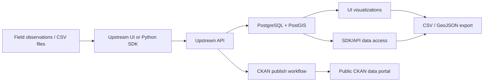
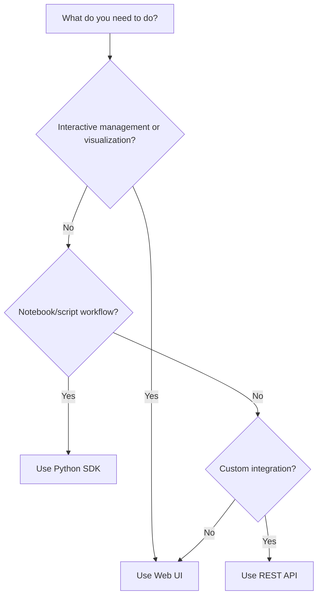

# Concepts

Understanding the core concepts behind Upstream helps you work with campaigns, stations, sensors, and measurements more effectively.

## Data hierarchy

Upstream organizes environmental sensor data in a hierarchical structure:

```
Campaign
└── Station
    ├── Sensor
    └── Measurement
```

### Campaign

A **campaign** is the top-level organizational unit. It represents a research project, field campaign, or Intensive Observation Period (IOP). Campaigns group related stations and provide shared context for access control and publication.

### Station

A **station** is a physical location or platform where sensors are deployed. Each station has:

- A geographic location (latitude/longitude)
- A timezone declaration for interpreting naive timestamps
- One or more sensors collecting measurements

### Sensor

A **sensor** (or variable) represents a measured quantity at a station. Each sensor has:

- An `alias` — a unique name used in CSV files and data access
- A `variablename` — a human-readable description
- Units of measurement
- Optional post-processing flags

### Measurement

A **measurement** is a single observation record. It includes:

- A collection timestamp
- Geographic coordinates
- One or more values, each corresponding to a sensor alias

## Data flow



## Interface selection



## Publishing workflow

Upstream can publish curated data to [CKAN](https://ckan.tacc.utexas.edu) data portals. Publishing creates CKAN datasets with:

- Sensors CSV as a resource
- Measurements CSV as a resource
- Campaign and station metadata as dataset extras

See [CKAN Integration](../ckan-integration/index.md) for details.

## Environments

The public Upstream documentation and default web UI are available at:

| UI | Default API |
| --- | --- |
| `https://upstream.pods.portals.tapis.io` | `https://upstreamapi.pods.portals.tapis.io` |

Project-specific API URLs can change and are access-controlled. Use the project selector and API docs link in the web UI to find the project instances available to your account.

If you use multiple project instances, see [Projects and API URLs](projects-and-api-urls.md) to understand how the UI chooses the active API.

## Next steps

- [Getting started](../getting-started/index.md) — Choose your interface and follow a quickstart.
- [Data preparation](../data-preparation/index.md) — Learn about CSV formats, templates, and validation.
- [Visualization guide](../visualization-guide/index.md) — Explore temporal charts and spatial maps.
- [Web UI guide](../web-ui-guide/index.md) — Detailed guide to using the web interface.
- [Python SDK guide](../python-sdk-guide/index.md) — Programmatic access from notebooks and scripts.
