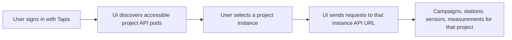
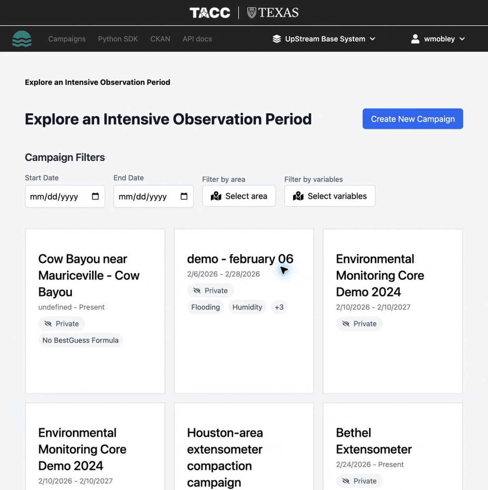

# Projects and API URLs

Upstream can run more than one project instance. Each project instance has its own API URL, data, permissions, and deployment lifecycle.

## What is a project instance?

A **project instance** is an Upstream deployment for a specific project, campaign group, or tenant. In the web UI, you may see a project selector after signing in. The selected project determines which API the UI calls.



## How the UI chooses an API URL

The UI supports two modes:

| Mode | How API URL is chosen | Typical use |
| --- | --- | --- |
| **Project discovery** | The UI discovers Upstream API pods the signed-in user can access, then uses the selected project's `apiUrl`. | Multi-project deployments. |
| **Fixed API URL** | The UI uses `VITE_UPSTREAM_API_URL` from environment/runtime config. | Single-project deployment or local development. |

When project discovery is enabled, the UI discovers API pods through Tapis Pods and looks for Upstream API pods. It then verifies the user's role for each candidate API. Projects with no access are hidden; projects whose role cannot be verified because of a temporary error may appear as unverified.

## Finding the projects you can access

Do not rely on a static list of project URLs. Project instances can be added, renamed, or retired over time, and each user may have access to a different set.

To find the projects available to you:

1. Open the Upstream web UI.
2. Sign in with Tapis.
3. Use the project selector in the header to see the project instances your account can access.
4. Select the project you want to work with.
5. Use the API docs link in the header to open that project's Swagger page.

!!! note "Walkthrough GIF planned"
    Add `../assets/gifs/project-selector.gif` here after recording the project selector/API docs workflow.

    ```markdown
    
    ```

The Swagger page URL is usually:

```text
<selected-api-url>/docs
```

The API base URL for SDK and REST calls is the same URL without `/docs`.

!!! note "Use the API URL for SDK and API calls"
    Browser URLs and API URLs are different. The web app URL usually does **not** include `api`; SDK and direct REST calls should use the API host for the selected project.

## Using the API URL for a selected project

After selecting a project in the UI, open its API docs link. If the Swagger page is:

```text
https://example-project-api.example.org/docs
```

then use this SDK base URL:

```text
https://example-project-api.example.org
```

For example:

```python
from upstream_sdk import UpstreamClient

client = UpstreamClient(
    base_url="https://example-project-api.example.org",
    username="your-username",
    password="your-password",
)
```

## Local development

For local development, the API usually runs at:

```text
http://127.0.0.1:8000
```

The UI can point to it with:

```bash
VITE_UPSTREAM_API_URL=http://127.0.0.1:8000
```

If `VITE_UPSTREAM_API_URL` is unset, deployed multi-project UI mode can discover project instances through Tapis.
