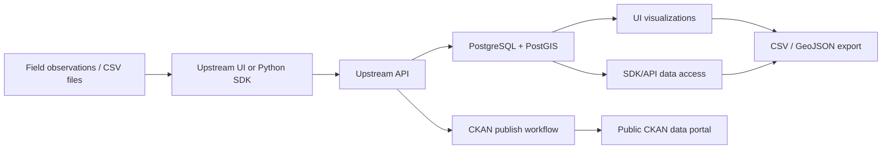

# Getting Started

Choose the interface that best fits your workflow:

## Web UI

The web interface is the fastest way to explore, manage, and visualize Upstream data. Sign in with your Tapis credentials and start working with campaigns, stations, sensors, and measurements right away.

**Best for:** Interactive exploration, one-off data uploads, visualization, and team collaboration.

→ [Web UI quickstart](quickstart-web-ui.md)

## Python SDK

The `upstream-sdk` Python package provides a high-level client for working with Upstream data from notebooks, scripts, and automated pipelines.

**Best for:** Researchers, data analysts, and anyone working with Python notebooks or scripts.

→ [Python SDK quickstart](quickstart-python-sdk.md)

## REST API

The Upstream API follows a standard REST pattern. Use it directly with `curl`, HTTPie, or any HTTP client for custom integrations.

**Best for:** Developers building custom tools, CI pipelines, or integrating Upstream with other systems.

→ [REST API quickstart](quickstart-api.md)

## Projects and API URLs

If you have access to multiple Upstream project instances, each project may use a different API URL. See [Projects and API URLs](../concepts/projects-and-api-urls.md) before configuring the SDK or making direct API calls.

## Data flow overview

