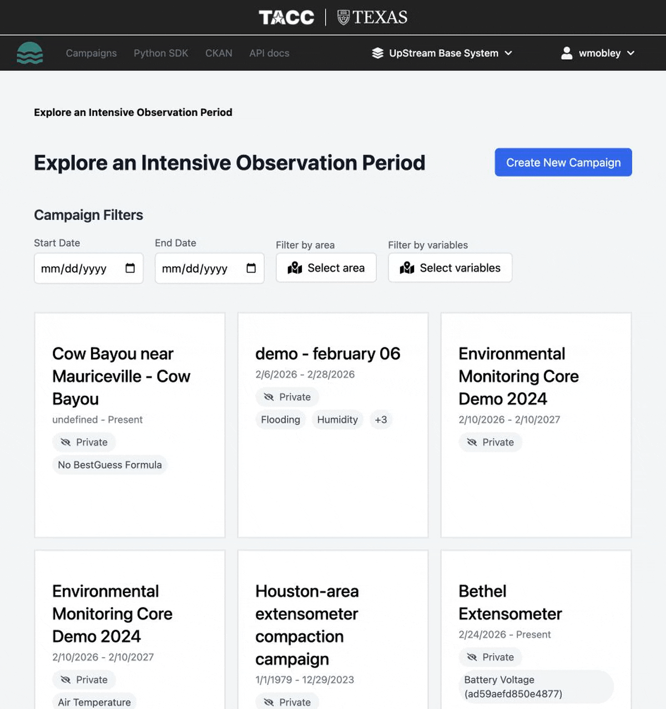

# Creating Campaigns

A **campaign** is the top-level organizational unit in Upstream. It represents a research project, field campaign, or Intensive Observation Period (IOP).

## Creating a new campaign

1. Navigate to the campaigns dashboard.
2. Click **Create Campaign**.
3. Fill in the campaign details:
    - **Name** (required) — a descriptive name for the campaign
    - **Description** — optional notes about the campaign purpose
    - **Contact name** — optional primary contact
    - **Contact email** — optional contact email
    - **Allocation** — optional allocation or project reference
4. Click **Create**.

## Campaign details

Once created, a campaign page shows:

- Campaign metadata (name, description, contact info)
- List of associated **stations** with sensor counts and summaries
- Options to edit campaign details
- Publish/unpublish actions

## What you can do with campaigns

| Action | Description |
| --- | --- |
| **Edit** | Update campaign name, description, and metadata |
| **Add station** | Create a new station within the campaign |
| **Publish** | Publish the campaign and its data to CKAN |
| **Unpublish** | Remove published data from CKAN |
| **Delete** | Remove the campaign and all associated data |

!!! warning "Deleting a campaign"
    Deleting a campaign removes all stations, sensors, and measurements within it. This action cannot be undone.
