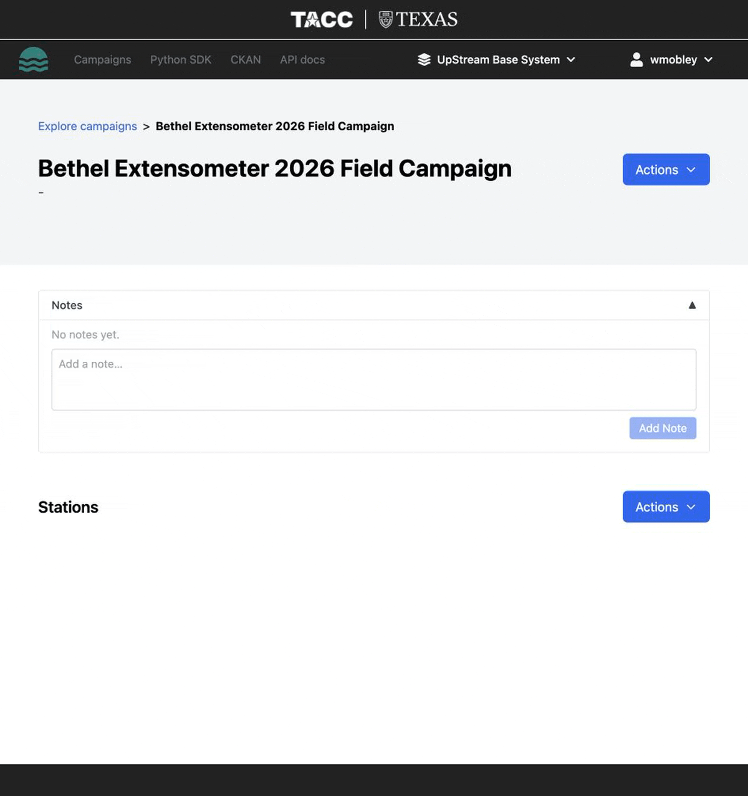

# Creating Stations

A **station** represents a physical location or platform where sensors are deployed. Each station belongs to a campaign and has its own timezone, sensors, and measurements.

## Creating a new station

1. Open a campaign page.
2. Click **Create Station** or **Add Station**.
3. Fill in the station details:
    - **Name** (required) — a descriptive name for the station
    - **Description** — optional notes about the station location or purpose
    - **Timezone** (required) — IANA timezone name (e.g., `America/Chicago`, `UTC`, `Europe/London`)
    - **Latitude** — station latitude in decimal degrees
    - **Longitude** — station longitude in decimal degrees
    - **Contact name** — optional primary contact
    - **Contact email** — optional contact email
4. Click **Create**.

!!! note "Walkthrough GIF planned"
    Add `../../assets/gifs/create-station.gif` here after recording the station creation workflow, including timezone selection.

    ```markdown
    
    ```

## Why timezone matters

The station timezone is critical for data interpretation:

- **Naive timestamps** (without timezone info) in your CSV uploads are interpreted using the station's declared timezone.
- **Timestamps with timezone info** (e.g., `2025-06-02T10:00:00Z` or `2025-06-02T10:00:00-05:00`) pass through unchanged.
- Choose the timezone where the station is physically located, not your local timezone.

## Station details

Once created, the station page shows:

- Station metadata (name, description, timezone, location)
- List of **sensors** with aliases and variable names
- **Measurement** counts and time ranges
- **Visualization** panels for temporal and spatial data
- Upload, export, and publish actions

## Next steps

- [Upload data](uploading-data.md) to your new station
- [View the station dashboard](dashboard.md)
- [Manage sensors](../sensors/managing.md)
