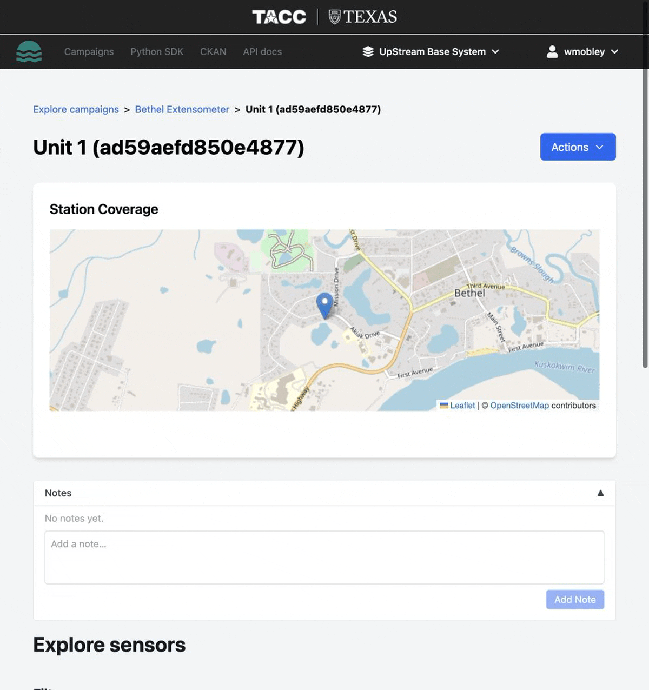

# Station Dashboard

The station dashboard is your central view for exploring a station's sensors, measurements, and visualizations.

## Dashboard layout

When you open a station, the dashboard displays:

- **Station metadata** — name, description, timezone, and geographic location
- **Sensor list** — all sensors deployed at this station, with alias, variable name, and units
- **Temporal charts** — time series plots showing measurement values over time
- **Spatial maps** — heat maps and route maps showing measurement locations
- **Measurement table** — tabular view of individual measurements

## Temporal visualizations

The dashboard includes two types of temporal views:

- **Line chart with confidence intervals** — shows trends and aggregated variation over time
- **Scatter plot** — shows individual measurement points for detailed inspection

Use the brush/zoom controls to focus on specific time ranges. Hover over data points for detailed tooltips.

See [Temporal visualizations](../../visualization-guide/temporal-visualizations.md) for details.

## Spatial visualizations

The dashboard includes spatial views:

- **Heat Map** — color-coded point map for comparing measurement intensity across locations
- **Geometry/Route Map** — interactive map for exploring measurement paths and individual locations

See [Spatial visualizations](../../visualization-guide/spatial-visualizations.md) for details.

## Station actions

From the dashboard you can:

| Action | Description |
| --- | --- |
| **Upload Data** | Upload sensor and measurement CSV files |
| **Export** | Download data as CSV or GeoJSON |
| **Publish** | Publish station data to CKAN |
| **Edit** | Update station metadata |
