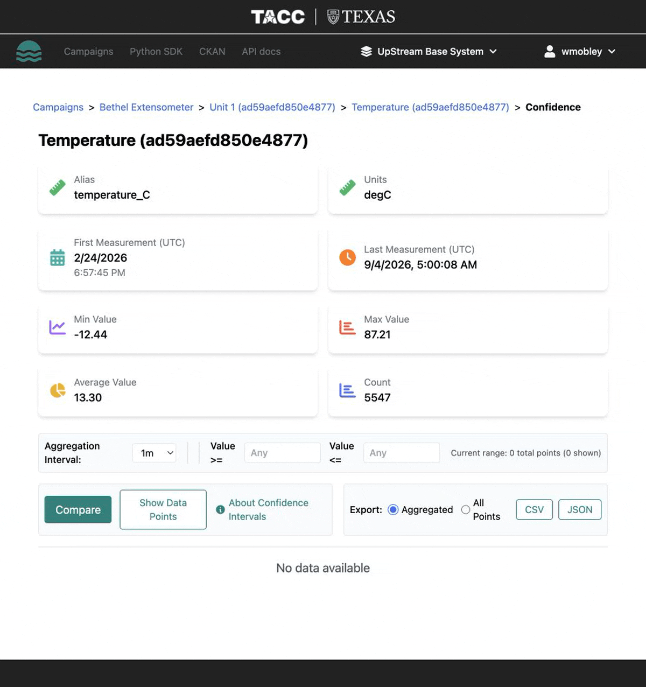

# Exporting Data from a Station

You can export station data as CSV or GeoJSON for use in external tools like Excel, R, Python, or GIS software.

## Exporting measurements

1. Open the station dashboard.
2. Look for the **Export** option.
3. Choose your format:
    - **CSV** — tabular format for spreadsheets and data analysis
    - **GeoJSON** — spatial format for GIS tools
4. The export includes the currently filtered subset of data (if filters are applied).

## Export formats

### CSV export

The CSV export includes:

- `collectiontime` — observation timestamp
- `Lat_deg` — latitude
- `Lon_deg` — longitude
- One column per sensor alias with measurement values

### GeoJSON export

The GeoJSON export produces a `FeatureCollection` where each feature represents a measurement point with:

- Geometry (point with coordinates)
- Properties including timestamp, sensor values, and metadata

## Filtering before export

If you have applied filters in the dashboard (time range, sensor selection, value range), the export respects those filters. Use this to export subsets of your data.

## Exporting sensors

You can also export the sensor configuration (aliases, variable names, units) as a separate CSV file. This is useful for documenting your sensor setup or re-uploading data to another station.

## Next steps

- Use exported CSV in [Python](../../python-sdk-guide/index.md) or R for analysis
- Import GeoJSON into [QGIS](https://qgis.org) or [ArcGIS](https://www.esri.com) for spatial analysis
- Publish curated exports to [CKAN](../campaigns/publishing.md) for sharing
